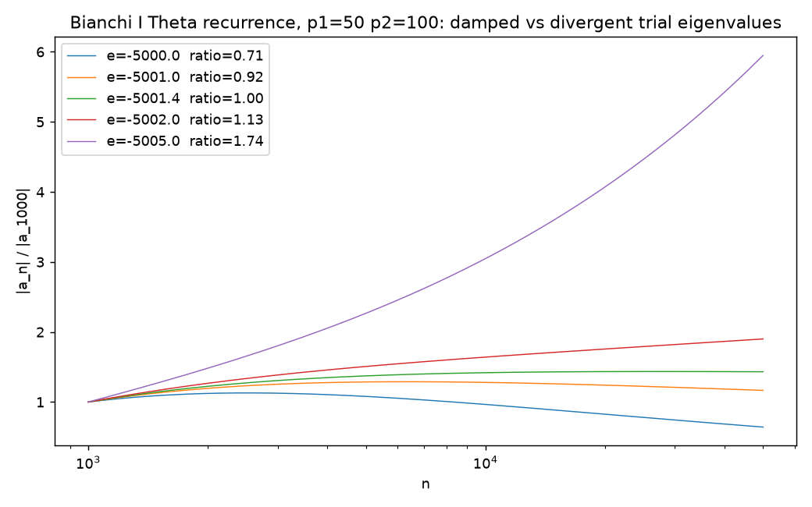

# Bianchi I spectrum scan

**Question.** `Bianchi 1 Spectrum/Recur.nb` and `Recur2.nb` looked for eigenvalues e of the Bianchi I Θ
operator (anisotropy parameters p1, p2) by shooting: iterate the three-term recurrence

    OffD1n[n] a[n+1] + Diagn[n] a[n] + OffD2n[n] a[n-1] = e a[n],    a[0] = 0, a[1] = 1,

to n ~ 10⁵ and watch whether |a_n| decays or grows.  The hand-written `Spect` log (archived) records the
verdict for each trial e.  **Method.** `lqc.bianchi1.spectrum.shoot` evaluates the same recurrence with the matrix
elements of `Recur.nb` (vectorised coefficients, plain loop); `lqc.bianchi1.spectrum.envelope_ratio` compares the mean
of |a_n| over the last 10 % of the range with a window after the small-n transient.  Regenerate the figure with
`uv run bianchi1/experiments/spectrum_scan.py`.

**Result.** For p1 = 50, p2 = 100 the log says e = −5000 and −5001 "mildly damped", −5001.4 "seems constant",
−5001.5 and −5002 "slow divergence", −5005 "divergent".  The Python envelope ratio (last window / window after
the transient, T = 50 000) is

| e | −4990 | −5000 | −5001 | −5001.4 | −5002 | −5005 | −5020 |
|---|---|---|---|---|---|---|---|
| ratio | 0.16 | 0.64 | 1.04 | 1.23 | 1.55 | 3.75 | 44 |

with the crossing between damped and divergent between −5000 and −5001.4, consistent with the log (the test
`tests/test_bianchi1_spectrum.py` checks −5001 damped vs −5005 divergent using windows that skip the transient).
`Asymp.nb`'s large-volume series of the matrix elements are reproduced symbolically; the leading constant terms
combine to 32 m1 m2 plus O(1/v) pieces, and the WKB-like form Re[x^{-1/2} e^{i log x (−(p1+p2)/3 + √(3e/8 − 4(p1²+p2²−p1p2))/6)}]
of `Recur2.nb` is available as `lqc.bianchi1.spectrum.wkb_asymptotic`.

Not done: locating eigenvalues by bisection on the envelope ratio, or checking the WKB form against the
shooting solution quantitatively.
