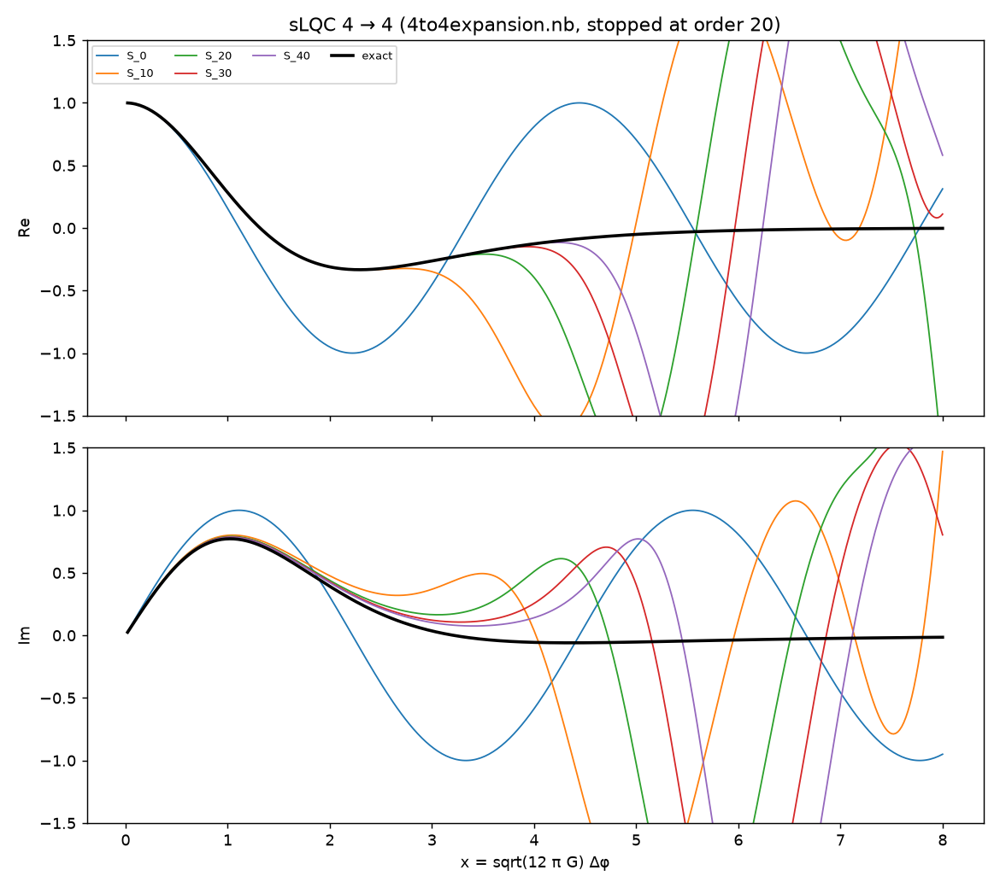
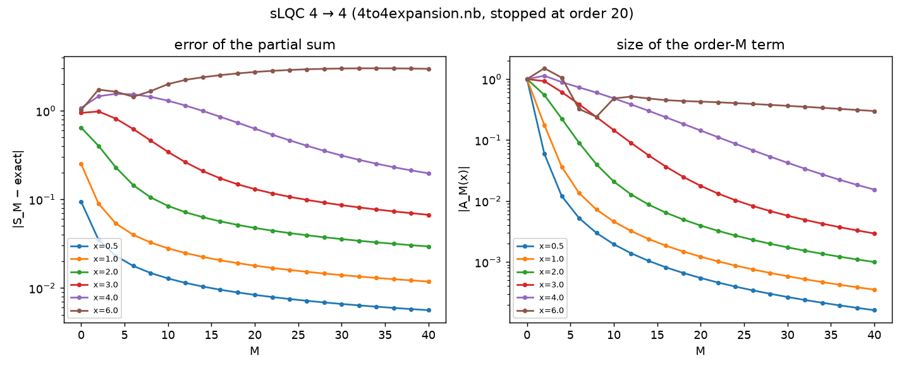
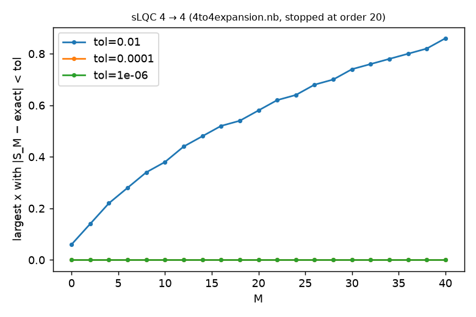

# Convergence of the vertex expansion beyond the notebooks

**Question.** The notebooks stopped at order 20 (4→4) and 18 (1→1) and left open whether the vertex expansion converges to the exact amplitude, and how fast.  **Method.** `experiments/compute_orders.py` computes the exact rational terms to order 40 with `lqc.vertex`; this report compares the partial sums S_M = Σ_{M'≤M} A_{M'} with the exact amplitude on x ∈ [0.02, 8].  Regenerate with `uv run experiments/convergence_study.py && uv run experiments/taylor_structure.py`.  The 1→1 series of ParamData.nb is the same computation as the 4→4 series in different units (volumes 4n with steps of 4 versus n with unit steps; the terms agree to all digits), so one series is studied.

## sLQC 4 → 4 (4to4expansion.nb, stopped at order 20)

**Result.** The partial sums do converge to the exact amplitude, but only as a power law: for M ≥ 20 the error |S_M − exact| falls like M^−0.57 at x = 0.5, M^−0.69 at x = 2 and M^−1.70 at x = 4, and the terms |A_M| themselves decay like a power of M rather than geometrically.  Doubling the notebooks' reach (order 20 → 40) reduces the error at x = 0.5 from 8.4e-03 to 5.6e-03 and at x = 2 from 4.8e-02 to 2.9e-02; the range of x where S_M is within 1e-2 of the exact amplitude grows from 0.58 to 0.86.  At x ≳ 6 the terms are still O(0.3) at order 40, so the series is useless there at any order reached here.  The section on the Taylor structure explains the mechanism: the even powers of x are exact at finite order and the odd powers converge only as a power law.

Orders available: 0 … 40 (step 2).  Highest power of x in A_M is x^{M/2} (checked: A_36: x^18, A_38: x^19, A_40: x^20).

| x | |S_20 − exact| | |S_40 − exact| | |A_40(x)| |
|---|---|---|---|
| 0.50 | 8.36e-03 | 5.62e-03 | 1.62e-04 |
| 1.00 | 1.79e-02 | 1.18e-02 | 3.51e-04 |
| 2.00 | 4.76e-02 | 2.94e-02 | 9.97e-04 |
| 3.00 | 1.30e-01 | 6.70e-02 | 2.93e-03 |
| 4.00 | 6.27e-01 | 1.97e-01 | 1.54e-02 |
| 6.00 | 2.74e+00 | 2.97e+00 | 2.99e-01 |

Range of x over which the partial sum is within tol of the exact amplitude:

| M | tol=0.01 | tol=0.0001 | tol=1e-06 |
|---|---|---|---|
| 0 | 0.06 | 0.00 | 0.00 |
| 4 | 0.22 | 0.00 | 0.00 |
| 8 | 0.34 | 0.00 | 0.00 |
| 12 | 0.44 | 0.00 | 0.00 |
| 16 | 0.52 | 0.00 | 0.00 |
| 20 | 0.58 | 0.00 | 0.00 |
| 24 | 0.64 | 0.00 | 0.00 |
| 28 | 0.70 | 0.00 | 0.00 |
| 32 | 0.76 | 0.00 | 0.00 |
| 36 | 0.80 | 0.00 | 0.00 |
| 40 | 0.86 | 0.00 | 0.00 |

### The stored a20 of 4to4expansion.nb

| x | |S_40 − exact| with Python a20 | same with the notebook's stored a20 | |a20_py − a20_nb| |
|---|---|---|---|
| 0.30 | 3.33e-03 | 3.50e-03 | 1.69e-04 |
| 0.50 | 5.62e-03 | 5.91e-03 | 2.87e-04 |
| 1.00 | 1.18e-02 | 1.25e-02 | 6.29e-04 |
| 2.00 | 2.94e-02 | 3.13e-02 | 1.86e-03 |
| 3.00 | 6.70e-02 | 7.30e-02 | 6.08e-03 |

## Taylor structure in x: why the convergence is slow

Write A_M(x) = Σ_p r_p(M) (i√2 x)^p.  e^{i√Θ x} = Σ_p (ix)^p Θ^{p/2}/p!, so the exact coefficient of x^p is i^p ⟨1|Θ^{p/2}|1⟩/p!.  For even p, Θ^{p/2} is banded (range p/2 in the volume basis), so only orders M ≤ p/2 can contribute; for odd p every order contributes.

| p (even) | r_p(M) = 0 for all M > p/2 ? | Σ_M r_p(M) (exact rational) | ⟨1|Θ^{p/2}|1⟩/(p! 2^{p/2}) (exact) | equal? |
|---|---|---|---|---|
| 0 | yes | 1 | 1 | yes |
| 2 | yes | 1/2 | 1/2 | yes |
| 4 | yes | 17/192 | 17/192 | yes |
| 6 | yes | 31/2880 | 31/2880 | yes |
| 8 | yes | 691/645120 | 691/645120 | yes |
| 10 | yes | 5461/58060800 | 5461/58060800 | yes |

All even coefficients up to x^10 are exact and finite-order: **yes** (this is an exact-rational check of the computed orders that does not use the notebooks).

| p (odd) | exact |coeff of x^p| | partial sum at M=18 | at M=Mmax | fitted error exponent α (error ~ M^-α) | Richardson-extrapolated |
|---|---|---|---|---|---|
| 1 | 1.2604977526 | 1.277918 (err 1.7e-02) | 1.271546 (err 1.1e-02) | 0.57 | 1.26087860 (err 3.8e-04) |
| 3 | 0.6359996294 | 0.634440 (err 1.6e-03) | 0.635254 (err 7.5e-04) | 0.92 | 0.63596578 (err 3.4e-05) |

The x¹ coefficient is the vertex expansion of ⟨1|√Θ|1⟩ (exact value from the generating function Fsqth); the x³ one of ⟨1|Θ^{3/2}|1⟩/3!.  Their slow power-law convergence is what limits the whole series at small x; the even coefficients are already exact.

### The stored a20 of 4to4expansion.nb, decided

A genuine order-20 term has zero coefficients of x^0, x^2, x^4, ... (up to x^38).  Taylor coefficients of x^p:

| p | Python A_20 | notebook's stored a20 |
|---|---|---|
| 0 | 0.000e+00+0.000e+00j | 0.000e+00+0.000e+00j |
| 1 | -0.000e+00-1.051e-03j | 0.000e+00-4.940e-04j |
| 2 | -0.000e+00+0.000e+00j | 0.000e+00+0.000e+00j |
| 3 | 0.000e+00-1.516e-04j | 0.000e+00-8.435e-05j |
| 4 | 0.000e+00+0.000e+00j | 0.000e+00+0.000e+00j |
| 5 | -0.000e+00-1.390e-05j | 0.000e+00-8.900e-06j |
| 6 | -0.000e+00+0.000e+00j | 0.000e+00+0.000e+00j |

Both have vanishing even coefficients, so the stored a20 has the right structure; the discrepancy is in the odd coefficients (the stored ones are about half the Python ones).  At fixed x the terms A_M(x) form a smooth, monotone sequence in M; inserting the stored a20 breaks it:

| x | A_16 | A_18 | A_20 (Python) | A_20 (notebook) | A_22 | A_24 |
|---|---|---|---|---|---|---|
| 0.5 | -8.155e-04 | -6.587e-04 | -5.449e-04 | -2.579e-04 | -4.595e-04 | -3.937e-04 |
| 1.0 | -1.846e-03 | -1.480e-03 | -1.218e-03 | -5.881e-04 | -1.022e-03 | -8.721e-04 |
| 2.0 | -6.425e-03 | -4.954e-03 | -3.954e-03 | -2.092e-03 | -3.239e-03 | -2.709e-03 |

(imaginary parts; the real parts are ~0 at these x).  The Python A_20 sits on the smooth trend of its neighbours and the stored a20 does not, and the Python term is produced by the same code that reproduces every stored lower order exactly.  Together with the odd denominators of the stored a20, the stored a20 is almost certainly not the order-20 term of this expansion (most likely a different or numerically rationalized computation).

