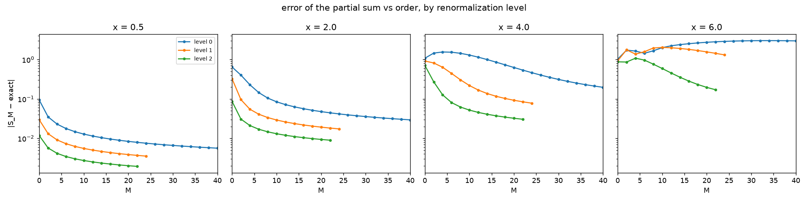
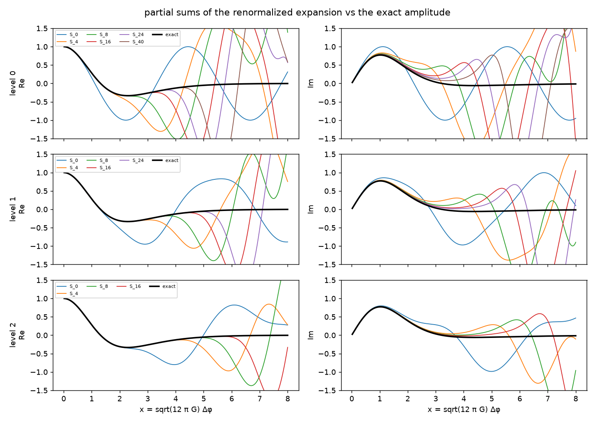
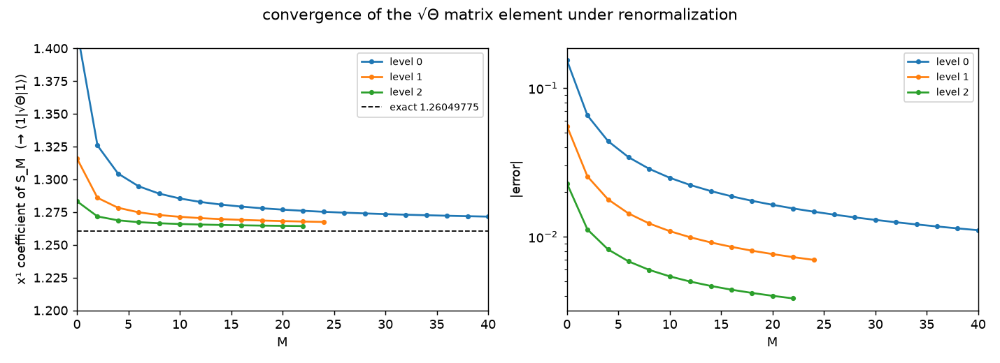
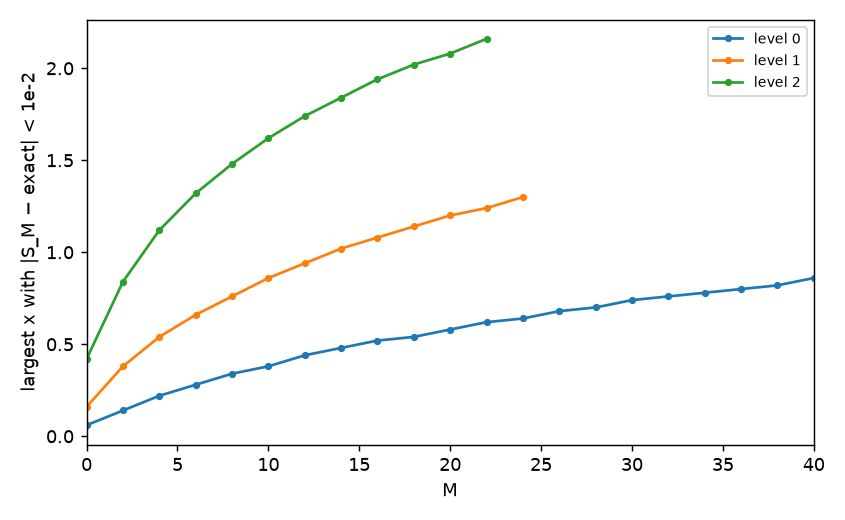
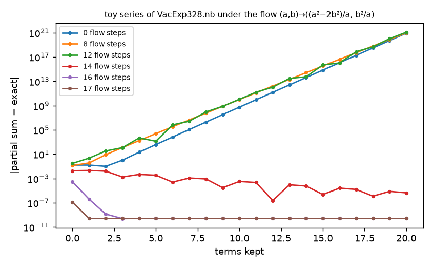

# The renormalized vertex expansion

**Question.** The notebooks' renormalization toys (RenormSimple.nb, VacExp328.nb) asked whether a renormalization flow can make a finite number of vertex-expansion terms accurate.  **Method.** The toy flow is real-space decimation of the resolvent; here it is applied to the actual Θ of the model (`lqc.renormalized`), and the same convergence diagrams as in the previous report are drawn at each level.  Regenerate with `uv run experiments/renormalization_levels.py && uv run experiments/renormalization_report.py`.

## Levels of decimation

Level n keeps the volumes v = 1, 1+2ⁿ, 1+2·2ⁿ, … and eliminates the others exactly (Schur complement of E−Θ), which is what the toy flow x→x²−2 of RenormSimple.nb does for a uniform chain.  The order-M term of the level-n expansion is a sum over walks of M hops on the kept lattice, with E-dependent effective hoppings and on-site resolvents; its frequencies are the eigenvalues of the clusters (kept site plus adjacent eliminated segments) instead of the bare 2v².  Level 0 is the original expansion; one hop at level n spans 2ⁿ original volumes.

**Result.** Each level of decimation makes the expansion converge markedly faster per order.  At x = 4 the bare series needs order >40 to get within 0.1 of the exact amplitude; level 1 needs order 20, level 2 order 6, level 2 order 6.  At order 8 the error at x = 2 goes from 1.1e-01 (level 0) to 1.5e-02 (level 2); at order 16 the range of x within 1e-2 of the exact amplitude grows from 0.52 (level 0) to 1.94 (level 2).  The estimate of ⟨1|√Θ|1⟩ from the x¹ coefficient, the slow part of the bare series, is 1.2792 at order 16 for level 0 and 1.2649 for level 2 (exact 1.2605).  The convergence remains power-law at every level (the non-locality of √Θ is not removed, only its prefactor shrinks), and one hop at level n spans 2ⁿ volumes, so an order-M term at level n resums histories that the bare series only reaches at order ≳ M·2ⁿ; the per-order cost also grows with the level (cluster polynomials of degree 2ⁿ⁺¹−1).

|S_M − exact| at the highest order computed per level:

| x | level 0, M=40 | level 1, M=24 | level 2, M=22 |
|---|---|---|---|
| 0.50 | 5.6e-03 | 3.5e-03 | 1.9e-03 |
| 2.00 | 2.9e-02 | 1.7e-02 | 9.0e-03 |
| 4.00 | 2.0e-01 | 7.8e-02 | 3.0e-02 |
| 6.00 | 3.0e+00 | 1.3e+00 | 1.7e-01 |

|S_M − exact| at fixed order M = 8 and M = 16:

| x | L0 M=8 | L1 M=8 | L2 M=8 | L0 M=16 | L1 M=16 | L2 M=16 |
|---|---|---|---|---|---|---|
| 0.50 | 1.5e-02 | 6.2e-03 | 3.0e-03 | 9.6e-03 | 4.3e-03 | 2.2e-03 |
| 2.00 | 1.1e-01 | 3.4e-02 | 1.5e-02 | 5.7e-02 | 2.2e-02 | 1.0e-02 |
| 4.00 | 1.4e+00 | 3.0e-01 | 6.2e-02 | 8.6e-01 | 1.2e-01 | 3.7e-02 |
| 6.00 | 1.7e+00 | 2.0e+00 | 7.6e-01 | 2.5e+00 | 1.8e+00 | 2.8e-01 |

Estimate of ⟨1|√Θ|1⟩ = 1.2604977526 from the x¹ coefficient of the partial sums:

| M | level 0 | level 1 | level 2 |
|---|---|---|---|
| 0 | 1.414214 (1.5e-01) | 1.316002 (5.6e-02) | 1.283305 (2.3e-02) |
| 2 | 1.325825 (6.5e-02) | 1.285892 (2.5e-02) | 1.271662 (1.1e-02) |
| 4 | 1.304419 (4.4e-02) | 1.278307 (1.8e-02) | 1.268705 (8.2e-03) |
| 8 | 1.289091 (2.9e-02) | 1.272759 (1.2e-02) | 1.266472 (6.0e-03) |
| 16 | 1.279186 (1.9e-02) | 1.269034 (8.5e-03) | 1.264894 (4.4e-03) |
| 24 | 1.275217 (1.5e-02) | 1.267475 (7.0e-03) | — |

Range of x with |S_M − exact| < 1e-2 (and < 1e-4):

| M | level 0 | level 1 | level 2 |
|---|---|---|---|
| 0 | 0.06 (0.00) | 0.16 (0.00) | 0.42 (0.00) |
| 4 | 0.22 (0.00) | 0.54 (0.00) | 1.12 (0.00) |
| 8 | 0.34 (0.00) | 0.76 (0.00) | 1.48 (0.00) |
| 12 | 0.44 (0.00) | 0.94 (0.00) | 1.74 (0.02) |
| 16 | 0.52 (0.00) | 1.08 (0.00) | 1.94 (0.02) |
| 24 | 0.64 (0.00) | 1.30 (0.00) | — |

