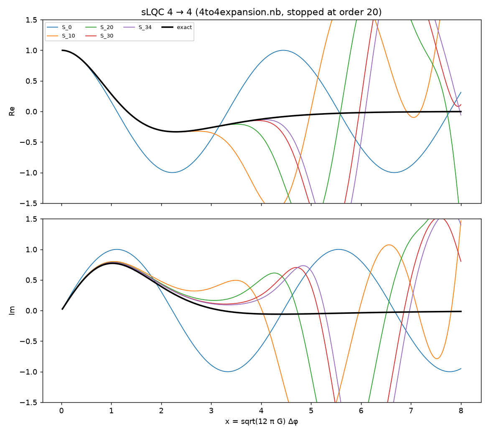
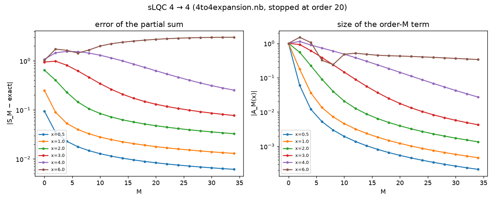
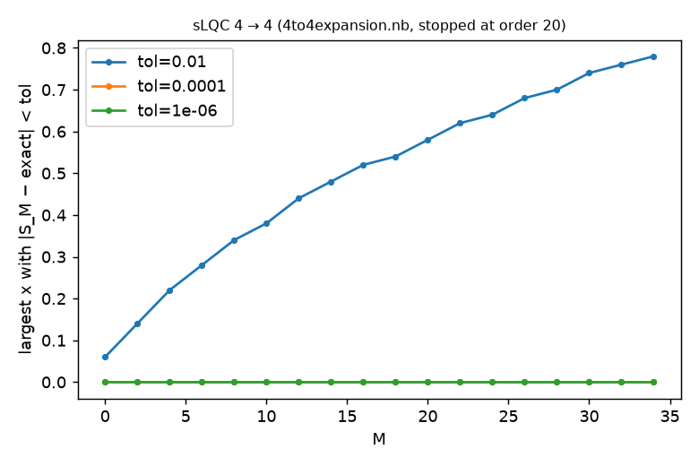
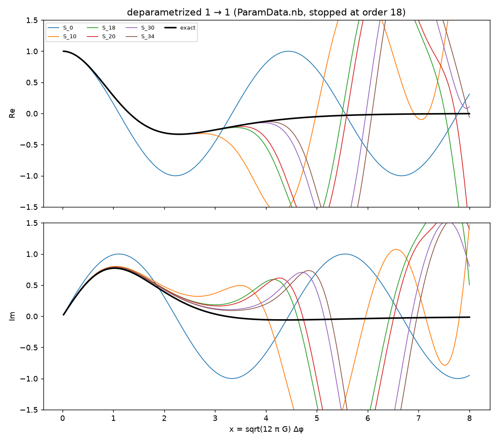
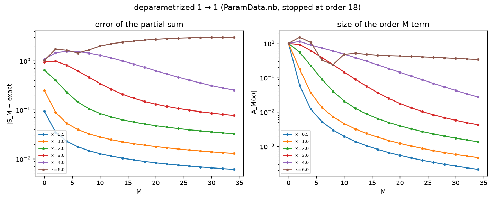
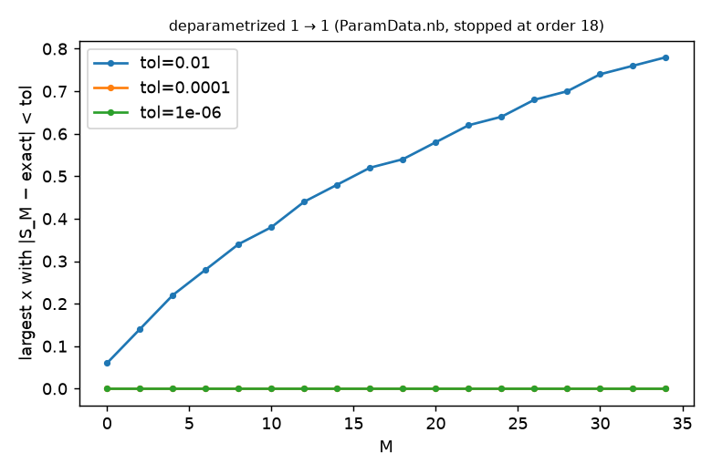

# Beyond the notebooks: convergence of the vertex expansion

Generated by `examples/beyond_notebooks.py` from `results/*/M*.json` (exact rational terms computed with `lqc.vertex`).  Partial sums S_M = Σ_{M'≤M} A_{M'} are compared with the exact amplitude on x ∈ [0.02, 8].

## sLQC 4 → 4 (4to4expansion.nb, stopped at order 20)

Orders available: 0 … 34 (step 2).  Highest power of x in A_M is x^{M/2} (checked: A_30: x^15, A_32: x^16, A_34: x^17).

| x | |S_20 − exact| | |S_34 − exact| | |A_34(x)| |
|---|---|---|---|
| 0.50 | 8.36e-03 | 6.15e-03 | 2.14e-04 |
| 1.00 | 1.79e-02 | 1.30e-02 | 4.67e-04 |
| 2.00 | 4.76e-02 | 3.27e-02 | 1.36e-03 |
| 3.00 | 1.30e-01 | 7.69e-02 | 4.25e-03 |
| 4.00 | 6.27e-01 | 2.53e-01 | 2.73e-02 |
| 6.00 | 2.74e+00 | 3.02e+00 | 3.38e-01 |

Range of x over which the partial sum is within tol of the exact amplitude:

| M | tol=0.01 | tol=0.0001 | tol=1e-06 |
|---|---|---|---|
| 0 | 0.06 | 0.00 | 0.00 |
| 4 | 0.22 | 0.00 | 0.00 |
| 8 | 0.34 | 0.00 | 0.00 |
| 12 | 0.44 | 0.00 | 0.00 |
| 16 | 0.52 | 0.00 | 0.00 |
| 20 | 0.58 | 0.00 | 0.00 |
| 24 | 0.64 | 0.00 | 0.00 |
| 28 | 0.70 | 0.00 | 0.00 |
| 32 | 0.76 | 0.00 | 0.00 |
| 34 | 0.78 | 0.00 | 0.00 |

### The stored a20 of 4to4expansion.nb

| x | |S_34 − exact| with Python a20 | same with the notebook's stored a20 | |a20_py − a20_nb| |
|---|---|---|---|
| 0.30 | 3.65e-03 | 3.82e-03 | 1.69e-04 |
| 0.50 | 6.15e-03 | 6.44e-03 | 2.87e-04 |
| 1.00 | 1.30e-02 | 1.36e-02 | 6.29e-04 |
| 2.00 | 3.27e-02 | 3.46e-02 | 1.86e-03 |
| 3.00 | 7.69e-02 | 8.30e-02 | 6.08e-03 |

## deparametrized 1 → 1 (ParamData.nb, stopped at order 18)

Orders available: 0 … 34 (step 2).  Highest power of x in A_M is x^{M/2} (checked: A_30: x^15, A_32: x^16, A_34: x^17).

| x | |S_18 − exact| | |S_34 − exact| | |A_34(x)| |
|---|---|---|---|
| 0.50 | 8.91e-03 | 6.15e-03 | 2.14e-04 |
| 1.00 | 1.91e-02 | 1.30e-02 | 4.67e-04 |
| 2.00 | 5.16e-02 | 3.27e-02 | 1.36e-03 |
| 3.00 | 1.48e-01 | 7.69e-02 | 4.25e-03 |
| 4.00 | 7.34e-01 | 2.53e-01 | 2.73e-02 |
| 6.00 | 2.64e+00 | 3.02e+00 | 3.38e-01 |

Range of x over which the partial sum is within tol of the exact amplitude:

| M | tol=0.01 | tol=0.0001 | tol=1e-06 |
|---|---|---|---|
| 0 | 0.06 | 0.00 | 0.00 |
| 4 | 0.22 | 0.00 | 0.00 |
| 8 | 0.34 | 0.00 | 0.00 |
| 12 | 0.44 | 0.00 | 0.00 |
| 16 | 0.52 | 0.00 | 0.00 |
| 20 | 0.58 | 0.00 | 0.00 |
| 24 | 0.64 | 0.00 | 0.00 |
| 28 | 0.70 | 0.00 | 0.00 |
| 32 | 0.76 | 0.00 | 0.00 |
| 34 | 0.78 | 0.00 | 0.00 |

## Taylor structure in x: why the convergence is slow

Write A_M(x) = Σ_p r_p(M) (i√2 x)^p.  e^{i√Θ x} = Σ_p (ix)^p Θ^{p/2}/p!, so the exact coefficient of x^p is i^p ⟨1|Θ^{p/2}|1⟩/p!.  For even p, Θ^{p/2} is banded (range p/2 in the volume basis), so only orders M ≤ p/2 can contribute; for odd p every order contributes.

| p (even) | r_p(M) = 0 for all M > p/2 ? | Σ_M r_p(M) (exact rational) | ⟨1|Θ^{p/2}|1⟩/(p! 2^{p/2}) (exact) | equal? |
|---|---|---|---|---|
| 0 | yes | 1 | 1 | yes |
| 2 | yes | 1/2 | 1/2 | yes |
| 4 | yes | 17/192 | 17/192 | yes |
| 6 | yes | 31/2880 | 31/2880 | yes |
| 8 | yes | 691/645120 | 691/645120 | yes |
| 10 | yes | 5461/58060800 | 5461/58060800 | yes |

All even coefficients up to x^10 are exact and finite-order: **yes** (this is an exact-rational check of the computed orders that does not use the notebooks).

| p (odd) | exact |coeff of x^p| | partial sum at M=18 | at M=Mmax | fitted error exponent α (error ~ M^-α) | Richardson-extrapolated |
|---|---|---|---|---|---|
| 1 | 1.2604977526 | 1.277918 (err 1.7e-02) | 1.272204 (err 1.2e-02) | 0.57 | 1.26083041 (err 3.3e-04) |
| 3 | 0.6359996294 | 0.634440 (err 1.6e-03) | 0.635182 (err 8.2e-04) | 0.92 | 0.63596844 (err 3.1e-05) |

The x¹ coefficient is the vertex expansion of ⟨1|√Θ|1⟩ (exact value from the generating function Fsqth); the x³ one of ⟨1|Θ^{3/2}|1⟩/3!.  Their slow power-law convergence is what limits the whole series at small x; the even coefficients are already exact.

### The stored a20 of 4to4expansion.nb, decided

A genuine order-20 term has zero coefficients of x^0, x^2, x^4, ... (up to x^38).  Taylor coefficients of x^p:

| p | Python A_20 | notebook's stored a20 |
|---|---|---|
| 0 | 0.000e+00+0.000e+00j | 0.000e+00+0.000e+00j |
| 1 | -0.000e+00-1.051e-03j | 0.000e+00-4.940e-04j |
| 2 | -0.000e+00+0.000e+00j | 0.000e+00+0.000e+00j |
| 3 | 0.000e+00-1.516e-04j | 0.000e+00-8.435e-05j |
| 4 | 0.000e+00+0.000e+00j | 0.000e+00+0.000e+00j |
| 5 | -0.000e+00-1.390e-05j | 0.000e+00-8.900e-06j |
| 6 | -0.000e+00+0.000e+00j | 0.000e+00+0.000e+00j |

Both have vanishing even coefficients; the discrepancy is in the odd ones.

